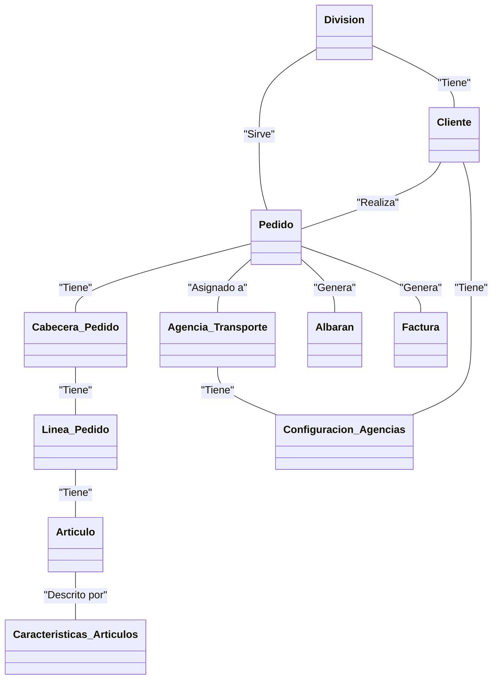
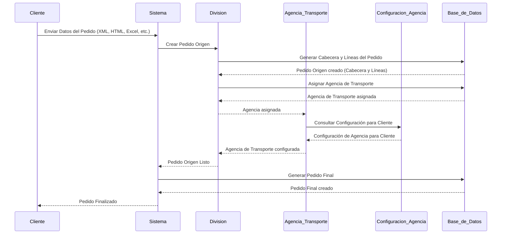

<div id='id_estructura' />

## Estructura BBDD

<div id='id_diagrama_general' />

### Diagrama General



La BBDD representa diversas **Divisiones** que operan como empresas proveedoras. Estas, gestionan sus propios **Clientes**, a quienes deben suministrar los **Artículos** solicitados a través de **Pedidos**.

Los Pedidos se componen de una **Cabecera** y **Líneas** de pedido. Para cada cabecera, existen una o varias líneas.

A los pedidos se le asigna una **Agencia de Transporte**, que tiene una **Configuración** específica por Cliente.

Las líneas de pedido contienen los artículos que se servirán a los clientes. Además se pueden consultar las **Características** detalladas de cada artículo (peso, longitud...).

Después de realizar la entrega del pedido al cliente, se emite un **Albarán** que recopila los datos del pedido, así como los detalles de los paquetes y artículos suministrados.

Algunos clientes tienen un servicio de facturación. Este proceso resulta en una **Factura** que contiene datos del pedido (cálculos, precio, impuestos, forma de pago...).

Cada una de estas entidades, se describen con más detalle en la sección correspondiente.

- [División](#id_division)
- Cliente
- [Pedido](#id_pedidos)
	- Cabecera
	- Línea
- [Artículo](#id_articulos)
	- Características detalladas
- Agencia de Transporte
	- Configuración de agencia
- Albarán
- Factura

<div id='id_division' />
 
### División
Para consultar la **división** de la empresa o cliente en cuestión se consulta la tabla **ipdivis**. 

```sql
SELECT *
  FROM ipdivis;
```
Un ejemplo de los datos que nos vamos a encontrar en esta tabla:

  
| CODDIV | CODEMP | CODDIVEMP | DESDIV                   | DABDIV     | NIF       | DIRECCION                     |
|--------|--------|-----------|--------------------------|------------|-----------|-------------------------------|
| 9148   | 001    | 9148      | MATERIALES AUROVITAS     | AUROVITAS  | A85104875 | AVDA DE BURGOS 16 D 5ª PLANTA |
| 111    | 001    | 111       | URIAGE                   | URIAGE     | B84039544 | JUAN BRAVO                    |
| 033    | 001    | 033       | SEDANA MEDICAL AB        | SEDANA     | W0302645G | PASEO DE LA CASTELLANA NUM    |
| 172    | 001    | 172       | VIROPHARMA SPAIN         | VIROPHARM  | B86225760 | Avenida del Partenón          | 
| 169    | 001    | 169       | ARTEMIS                  | ARTEMIS    | B86141504 | CEA BERMUDEZ                  |
| 005    | 001    | 005       | RATIOPHARM INTERNACIONAL | RATIOINT   | A79347134 | C/ ANABEL SEGURA              | 
| 311    | 001    | 311       | BECTON DICKINSON MMS     | BECTON MMS | A50140706 | CAMINO DE VALDEOLIVA S/N      | 
 
<div id='id_pedidos' />
 
### Pedidos
 
Los **pedidos** están formados por una cabecera y una o múltiples líneas. Esta información, que desglosaremos y detallaremos en secciones posteriores, se almacena en la BBDD en las siguientes tablas:
 
```sql
SELECT * 
  FROM ipcabpeorig; -- Cabecera de pedido origen
SELECT * 
  FROM iplinpeorig; -- Líneas de pedido origen

SELECT * 
  FROM ipcabpe; -- Cabecera de pedido
SELECT * 
  FROM iplinpe; -- Líneas de pedido
```
<div id='id_pedido_origen' />

#### Pedido Origen
El pedido origen es el resultado de la carga de datos inicial de un determinado pedido facilitado por la empresa. 

Este pedido puede facilitarse en distintos formatos (**txt**, **xlsx**, **csv**...) y ha de ser registrado en la BBDD. En este momento no se cuenta con todos los datos necesarios para conformar el pedido, pues muchos de ellos son **calculados** y será necesario ejecutar determinados procesos en la BBDD para crear el pedido final.

```sql
SELECT * 
  FROM ipcabpeorig; -- Cabecera de pedido origen
SELECT * 
  FROM from iplinpeorig; -- Líneas de pedido origen
```

<div id='id_pedido_final' />

#### Pedido Final
Una vez cargado el [pedido origen](#id_pedido_origen) se harán los procedimientos almacenados y serán calculados todos los campos necesarios para conformar el pedido. 

```sql
SELECT * 
  FROM ipcabpe; -- Cabecera de pedido
SELECT * 
  FROM iplinpe; -- Líneas de pedido
```

<div id='id_cabecera_pedido' />

#### Cabecera de pedido
A continuación se muestran los campos que forman la **clave primaria** de la cabecera del pedido.
<table>
<tr>
        <th>Campo BBDD</th>
        <th>Descripción</th>
    </tr>
    <tr>
        <td>codped</td>
        <td>Código del pedido</td>
    </tr>
    <tr>
        <td>coddiv</td>
        <td>División o compañía del pedido</td>
    </tr>
    <tr>
        <td>seqped</td>
        <td>Versión del pedido</td>
    </tr>
    <tr>
        <td>anoped</td>
        <td>Año del pedido</td>
    </tr>  
</table>

<div id='id_articulos' />

### Artículos

Cada **División** tiene sus propios **Artículos**. El maestro de artículos es la tabla **ipartic**.

```sql
SELECT *
  FROM ipartic
```
En esta tabla se encuentra toda la información del artículo, como su precio, su descripción... Se almacena por código de división (**coddiv**) y código de artículo (**codartdiv**). 

De esta forma, una determinada división numera todos sus artículos. A continuación lo veremos con un ejemplo.

La División KARO (**coddiv**: 471) tiene los artículos: 1002184, 1002183, 1002182, 1002016... Estos códigos (**codartdiv**) identifican los artículos dentro de la división. 

Para identificar y detallar los artículos **ALLOGA** tiene un código de artículo genérico (**codart**) que obtiene al concatenar **coddiv** y **codartdiv**. De esta forma, el artículo 1002184 de KARO (división 471), será para ALLOGA: 4711002184.

A continuación veamos cómo se vería la consulta en la tabla maestro de artículos.
```sql
SELECT codart, coddiv, codartdiv, codnac, codean, desart
  FROM ipartic
 WHERE coddiv = '471'
   AND codart IN ('4711002184','4711002183','4711002182','4711002016');
```

| CODART | CODDIV | CODARTDIV | CODNAC | CODEAN | DESART |
|------------|--------|-----------|----------|----------------|--------------------------------------------------------------|
| 4711002184 | 471 | 1002184 | 193955.5 | 05425012533547 | REMESCAR PROGRAMA CORRECT CONTORNO OJOS PARPADOS CAIDOS 8 ML |
| 4711002183 | 471 | 1002183 | 191939.7 | 05425012533257 | REMESCAR PROGRAMA CORRECTOR BOLSAS+REPARADOR NOCHE |
| 4711002182 | 471 | 1002182 | 189452.6 | 05425012532991 | REMESCAR BOLSAS Y OJERAS 16ML |
| 4711002016 | 471 | 1002016 | 160849 | 07350087736334 | E45 ERYPLAST PASTA AL AGUA 200GR |

Para cada uno de esos artículos (**codart**) podemos consultar sus características específicas en la tabla **ipartproplog**. 

```sql
SELECT *
  FROM ipartproplog
```
Continuando con el ejemplo anterior:
```sql
SELECT codart, pvpvigente, fecvignp, pvpnuevo,largouni, anchouni, altouni, pesouni, unipaq
  FROM ipartproplog
 WHERE codart IN ('4711002184','4711002183','4711002182','4711002016');
```

En esta tabla podremos ver el detalle de estos artículos, con campos como ancho, largo, alto, peso...

| CODART | PVPVIGENTE | FECVIGNP | PVPNUEVO | LARGOUNI | ANCHOUNI | ALTOUNI | PESOUNI | UNIPAQ |
|------------|------------|----------|----------|----------|----------|---------|---------|--------|
| 4711002184 | 29 | 69 | 0 | 0 | 3 | 10 | 14 | 20 |
| 4711002183 | 32 | 07 | 0 | 0 | 40 | 100 | 145 | 49 |
| 4711002182 | 39 | 45 | 0 | 0 | 60 | 4 | 170 | 50 |
| 4711002016 | 13 | 89 | 0 | 0 | 44 | 60 | 180 | 200 |

<div id='id_status' />

### Status

En esta tabla podemos ver la relación entre cada status y su descripción.

Ejemplo:

Al consultar una línea de pedido, podemos ver su status en el campo **status**. 

Para conocer la descripción de este estado debemos consultar la tabla **ipstatus**. 

```sql
SELECT tipostatus, status, desstatus
  FROM ipstatus
 WHERE tipostatus = 'LP' -- Línea de Pedido
   AND status = '500'; -- Status
```

Un ejemplo con el contenido de la tabla podría ser el siguiente:

| tipostatus | status | desstatus |
|-----------|-----------|-----------|
| LP | 5000 | LINEA DE ACONDICIONAMIENTO | 
| CP | -6950 | ERROR GENERANDO DEM. DE ACONDI | 

A continuación se muestran algunos de los tipos más utilizados:
<table>
	<tr>
        <th>Tipo Status</th>
        <th>Descripción</th>
    </tr>
	<tr>
        <td>LP</td>
        <td>Línea de Pedido</td>
    </tr>
	<tr>
        <td>CP</td>
        <td>Cabecera de Pedido</td>
    </tr>
	<tr>
        <td>IRS</td>
        <td>Impresiones (Facturas)</td>
    </tr>
</table>

<div id='id_procesos' />

### Procesos

<div id='id_asignacion_agencias_transporte' />

#### Asignación de Agencias de Transporte

Los pedidos en este sistema constan de una estructura de **Cabecera** y **Líneas**. Cada cabecera está asociada con una o varias líneas específicas. Al iniciar la creación de un pedido, se generan tanto un pedido origen como un pedido final, lo que implica la existencia de cuatro entidades de datos: cabecera origen, línea origen, cabecera y línea.

Cuando un pedido evoluciona desde su estado de origen hasta el estado final, se procede a asignarle una **Agencia de Transporte**. Esta asignación se realiza mediante la consulta de una tabla que contiene la configuración detallada de las agencias. La configuración es específica de cada **Cliente**.

En el momento en el que el cliente genera un pedido, la división correspondiente se encargará de su gestión. Para comunicar el pedido, el cliente tiene la flexibilidad de enviar los datos en el formato que desee, ya sea XML, HTML, Excel u otros formatos. En este punto, se genera el pedido origen, incluyendo tanto la cabecera como las líneas, extrayendo los detalles del pedido directamente del origen proporcionado por el cliente. Posteriormente, se procede a la asignación de una agencia de transporte, marcando así la transición del pedido desde su origen hasta el estado final. Es importante destacar que cada cliente tiene asociada una configuración específica en la agencia de transporte, ajustada inicialmente al realizar el pedido, para garantizar un servicio personalizado y eficiente.

